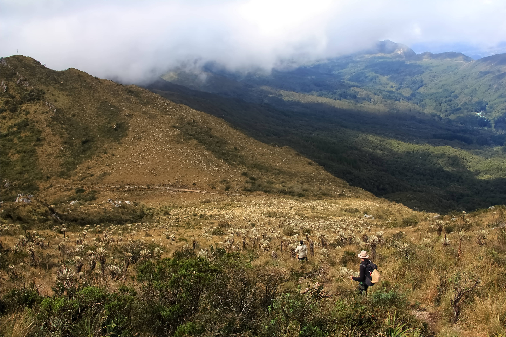

# Miradas Naturalistas — Scroll Storytelling Horizontal

## Overview
Sitio editorial de scroll-storytelling horizontal para **LaBosquescuela UBA**, basado en el cuadernillo *Miradas Naturalistas* (Cerros Orientales, Bogotá · Mayo 2026). Recorre cinco micro-cursos (Niebla, Ericáceas, Líquenes, Hongos, Especies problema) en 50 escenas con fotografía protagonista, glosario interactivo y bitácora del visitante.

**Producción**: https://miradas-naturalistas.web.app

## Stack
- **HTML/CSS/JS vanilla** servido como módulos ES.
- **Vite 5** como dev server y bundler (HMR + asset hashing + bundle único).
- **Firebase Hosting** (proyecto `labosquescuela-uba`, site `miradas-naturalistas`) con cache headers de 1 año en assets e `index.html` `no-cache`.
- **sharp** para generar variantes WebP de las fotografías (script local).
- Cero dependencias de runtime: el bundle JS de producción pesa **15.7 KB / 6.4 KB gzip**.

## Comandos
```bash
npm install                          # una vez
npm run dev                          # dev server con HMR → http://localhost:5173
npm run build                        # producción → dist/
npm run preview                      # sirve dist/ → http://localhost:4173
npm run deploy                       # build + firebase deploy a miradas-naturalistas
node scripts/optimize-images.mjs     # regenera WebPs en assets/img/optimized/
node scripts/insert-momentos.mjs     # inserta/idempotente: 15 escenas de momentos + renumera counters
```

## Estructura del recorrido (65 escenas)

Cada micro-curso se organiza con **tres momentos del ciclo de cuidado** (Explorar, Observar, Crear) que aparecen como escenas de transición tipo `momento` (full-bleed, tipografía display) entre los bloques de contenido.

| # | Capítulo | Escena | Layout |
|---|----------|--------|--------|
| 01 | Antesala | Portada | `cover` (full-bleed + overlay) |
| 02 | Antesala | Manifiesto + 3 momentos | `manifesto` (2 columnas) |
| 03 | 01 Niebla | Apertura curso 01 | `course` (img + meta) |
| 04 | 01 Niebla | 1.1 Horizonte Verjonita | `split` |
| 05 | 01 Niebla | 1.2 Ríos de niebla | `image-only` + caption |
| 06 | 01 Niebla | Ruta AAA | grid 1fr/1.6fr con 3 fases |
| 07 | 01 Niebla | 2 Páramos de Oriente | `split--rev` |
| 08 | 01 Niebla | 3 Amanecer en El Verjón | `image-only` |
| 09 | 01 Niebla | 4 Ranita bogotana | `split` |
| 10 | 01 Niebla | 5 Colibrí entre la niebla | `split--rev` |
| 11 | 01 Niebla | 6 Liquen Cora | `split` |
| 12 | 01 Niebla | Mirada micro · Cora | `grid` 4 celdas |
| 13 | 01 Niebla | 7 Amanita + cierre | `stack` (img + side) |
| 14 | 02 Ericáceas | Apertura curso 02 | `course` |
| 15-21 | 02 Ericáceas | 7 escenas (Cavendishia, Disterigma, Vaccinium tríptico, Plutarchia, Macleania, micro raicillas, cierre Simpoiesis) | mix |
| 22 | 03 Líquenes | Apertura curso 03 | `course` |
| 23-32 | 03 Líquenes | 10 escenas (Rhizocarpon, Lecanora, Cladonia, Coenogonium, Cryptothecia, Cora, Crocodia/Lobariella/Parmotrema tríptico, Pannaria/Xanthoparmelia, Trentepohlia/Graphis, micro hospedantes) | mix |
| 33 | 04 Hongos | Apertura curso 04 | `course` |
| 34-39 | 04 Hongos | 6 escenas (Aleurodiscus, Amanita pantherina, Suillus, Macrolepiota/Laccaria, micro micorrizas, Trametes + cierre) | mix |
| 40 | 05 Especies problema | Apertura curso 05 | `course` |
| 41-47 | 05 Especies problema | 7 escenas (Gaultheria, Agesander, Bombus, Mariposa monarca, micro helechos, Astylus tríptico, cierre interconexión) | mix |
| 48 | Cierre | Quote final | center |
| 49 | Cierre | Bitácora CTA + créditos | grid 1/1 |
| 50 | Cierre | Vuelve a caminar | `cover` |

## Sistema visual

### Paleta (default · "bosque")
| Token | Valor | Uso |
|-------|-------|-----|
| `--paper` | `#ece5d6` | fondo principal |
| `--paper-2` | `#e3dac6` | fondo alterno (mat 02) |
| `--ink` | `#1d1f1a` | texto y fondo oscuro |
| `--ink-2` | `#3a3b32` | texto secundario |
| `--liquen` | `#c5673a` | acento por defecto (portada, manifiesto, cierre, marca) |
| `--liquen-soft` | `#d18960` | variante suave del acento |
| `--moss` | `#5b6f4a` | tags secundarios |
| `--forest` | `#2b3f2c` | fondo `scene--forest` |
| `--fog` / `--fog-2` | `#8a9aa0` / `#b9c4c7` | textos sobre fondo oscuro |
| `--berry` / `--gold` | `#8b2c47` / `#c89a3a` | acentos auxiliares editoriales |

### Acentos por curso
Cada `<section data-course="N">` redefine localmente `--liquen` y `--liquen-soft` para teñir números, eyebrows, popovers de glosario, callouts y momentos del ciclo de cuidado con el color del bioma correspondiente. Los descendientes heredan sin tocar las reglas existentes.

| Curso | Bioma | `--liquen` (principal) | `--liquen-soft` |
|-------|-------|------------------------|-----------------|
| 01 | Niebla | `#6b8a96` Azul Niebla | `#aac4cf` |
| 02 | Ericáceas | `#8b3a4a` Vino Frutal | `#c2566a` |
| 03 | Líquenes | `#4a6b34` Verde Liquen | `#6b8e4e` |
| 04 | Hongos / Micelios | `#a85a3a` Terracota Fúngica | `#c89545` |
| 05 | Especies problema | `#8b6520` Ocre Polinizador | `#c89545` |

Los fondos translúcidos (callouts, sub-cards) usan `color-mix(in srgb, var(--liquen) 10%, transparent)` para responder dinámicamente al acento del curso. La portada, el manifiesto, el cierre y el logo SVG mantienen el `--liquen` por defecto (`#c5673a`) como identidad de marca.

Paletas globales alternativas exploradas durante el diseño (editables en `:root` de `styles.css` swapeando los tokens `--paper`, `--ink`, `--liquen`): `niebla` (`#e8eae6` / `#23282a` / `#6b8074`), `fucsia` (`#efe7d8` / `#1d1818` / `#a23a5e`), `pajonal` (`#f1ead0` / `#1f1c12` / `#a06a1f`).

### Tipografía
| Variable | Familia | Uso |
|----------|---------|-----|
| `--serif` | `Caprasimo` (Georgia fallback) | títulos, números grandes, `momento-title`, citas |
| `--sans` | `DM Sans` 300/400/500/600 | copy, UI, `body-prose` cuando no es serif |
| `--mono` | `Manrope` 400/500/600 | eyebrows, etiquetas en versalitas espaciadas (`.spaced-caps`, `letter-spacing: .32em`), `caption`, `step` de momentos |
| `--hand` | `Kalam` (cursive) | manuscritos editoriales, washi/pista — uso reservado |
| `--brand-font` | `Poppins` | identidad de marca · `top-nav .brand` |

Escalas serif: `display--xl` (clamp 64–160px), `display--lg` (48–110), `display--md` (38–84), `display--sm` (28–56), `body-prose` (clamp 19–24), `caption` (12.5px). El `momento-title` usa `clamp(72px, 12vw, 200px)` (110px tope en móvil ≤1300px).

### Layouts (clases en `styles.css`)
- `.layout-cover` — imagen full-bleed con `.veil` degradado y `.content` en grid 3 filas.
- `.layout-split` / `.layout-split--rev` — 50/50 imagen + texto.
- `.layout-image-only` — imagen completa con `.float-caption` posicionado absoluto.
- `.layout-diptych` — 2 imágenes a sangre con etiqueta `.label` abajo.
- `.layout-grid` — rejilla 2x2 con `.grid-head` que ocupa una franja superior.
- `.layout-course` — apertura de curso (img izq, meta der con número gigante).
- `.layout-stack` — imagen arriba + columna `.pane-side` con sub-card destacada.
- `.layout-manifesto` — 2 columnas con `.col-meta` (caja con `.divider`) y `.col-body` (drop cap).
- `.layout-quote` — text-only centrado, full-bleed.
- `.layout-momento` — escena de transición del ciclo de cuidado (Explorar / Observar / Crear). `step` en mono caps + `momento-title` display gigante con la última letra en `<em>` italic acento `--liquen` + `momento-lede` opcional.
- Trípticos: `display: grid; grid-template-columns: 1fr 1fr 1fr;` inline.

### Anchos de escena (clases multiplicadoras de `100vw`)
- `.scene--w-80` (0.8), `.scene--w-100` (1.0), `.scene--w-110` (1.1), `.scene--w-130` (1.3). Escenas más densas usan más ancho horizontal.

## Interacciones

### Scroll horizontal (desktop)
- `.stage-wrap` `overflow-x: auto`. Listener `wheel` en `.stage` traduce `deltaY` a `scrollLeft` con multiplicador `1.4`. Si `|deltaX| > |deltaY|` (trackpad horizontal nativo) no se intercepta.
- Teclas `← / →`, `PageUp / PageDown`, `Home / End`.
- Barra inferior fija: `progress-fill` lineal + `progress-marks` con un marcador por capítulo + lista de capítulos clicables (`.chap-btn`) que hace `scrollTo({ left: scene.offsetLeft })`.

### Scroll vertical (móvil y tablet ≤ 1300px)
- Misma DOM. Media query reescribe el `stage-wrap` a `overflow-y: auto; scroll-snap-type: y proximity`, las escenas pasan a `width: 100% !important; min-height: 92dvh`, los layouts colapsan a `flex-direction: column`, las imágenes ocupan ~56vh, los trípticos se vuelven 3 filas.
- El listener `wheel` y el `keydown` se desactivan vía `isMobile()` (`matchMedia('(max-width: 1300px)')`).
- `updateProgress()` y `buildProgressMarks()` cambian a `offsetTop` / `scrollTop` / `scrollHeight`.
- La barra inferior pasa a flex column; los chips de capítulos quedan en carrusel horizontal con scroll lateral.

### Glosario — flip cards
- Términos resaltados en el texto (`<span class="g-term" data-term="…">`) abren un **popover** posicionado relativo al término, con eyebrow + término + definición.
- Cajón lateral (`#drawer-glossary`) con buscador `<input class="gloss-search">` y rejilla `.gloss-list` (2 columnas, 1 en móvil) de `.gloss-card` con animación 3D:
  - Estructura: `<button class="gloss-card"><div class="gc-inner"><div class="gc-face gc-front">…</div><div class="gc-face gc-back">…</div></div></button>`.
  - `transform-style: preserve-3d`, `backface-visibility: hidden`, `transition: transform 600ms cubic-bezier(.4,0,.2,1)`.
  - Click → `.is-flipped` → `rotateY(180deg)`.
  - Anverso: papel `--paper-2`, marco interior 1px, término en `Caprasimo` clamp(26-38), categoría en mono caps liquen.
  - Reverso: fondo `--ink`, texto `--paper`, borde-izq `--liquen`, círculo decorativo arriba-derecha, definición scrollable.

### Bitácora — localStorage
- Cajón `#drawer-log`. Form con `name` (max 40) y `text` (max 600). Persistencia en `localStorage` bajo `mn_bitacora_v1` como JSON array.
- Cada entrada guarda: `name`, `text`, `scene` (capítulo + título de la escena visible al guardar, vía `currentSceneLabel()`), `date` (formateada `es-CO`).
- Lista de entradas con eliminar individual.

### Splash
- `.splash` cubre el viewport en la carga, fade out a los 700ms via `setTimeout` que añade `.hidden`.

## Performance

### Imágenes — WebP con fallback
Cada `` del HTML se sirve dentro de un `<picture>` con `<source type="image/webp">` apuntando a la variante optimizada y el JPG/PNG original como fallback:

```html
<picture>
  <source type="image/webp" srcset="assets/img/optimized/niebla-02-rios.webp">
  
</picture>
```

- Los navegadores modernos descargan **WebP** (Chrome, Firefox, Safari 14+, Edge); los antiguos caen al JPG.
- Las 53 variantes se generan con `sharp` (quality 80, effort 5) vía `scripts/optimize-images.mjs`.
- Reducción global: **27.2 MB → 12.1 MB (-56 %)**. Casos extremos: PNG `micro-raicillas-vaccinium.png` 1281 KB → 52 KB (-96 %), JPG `niebla-04-amanecer.jpg` 218 KB → 44 KB (-80 %).
- Vite hashea ambos formatos al build (cache-busting independiente para WebP y JPG).

### Otras optimizaciones
- `loading="lazy" decoding="async"` en los **67 ``**: solo se descargan cuando entran en viewport.
- Bundle JS de producción: **15.7 KB / 6.4 KB gzip**. CSS: **22.6 KB / 5.2 KB gzip**.
- Firebase Hosting con `Cache-Control: public, max-age=31536000, immutable` para assets hasheados; `no-cache` en `index.html` para garantizar refresh inmediato tras deploy.
- La portada usa `background-image` CSS con la misma JPG (cache-hit cuando aparece de nuevo como `` en escenas posteriores).

## Glossary data (`glossary.js`)
**31 términos**. Cada uno: `{ id, term, cat, def }`. `window.GLOSSARY` (array) + `window.GLOSS_MAP` (lookup por `id`). Categorías: meteorología, ecología, fisiología, micología, liquenología, etología, etc.

25 de los 31 están sembrados en el HTML como `<span class="g-term" data-term="…">` (popovers); los demás solo aparecen en el cajón del glosario.

Términos: `niebla, ruta-aaa, aerosoles, bioindicador, holobionte, micelio, micorriza, rizosfera, apotecio, soredios, talo, balitosporas, basidiomicetes, tixotropico, ericaceas, antocianinas, efecto-borde, tesela, simpoiesis, especies-problema, polinizacion-zumbido, etica-observacion, paramo, criptogama, endemismo, sucesion-ecologica, fotobionte, micobionte, briofita, epifita, borde-de-bosque`.

## Design tokens — resumen rápido
| Categoría | Valor |
|-----------|-------|
| Gutter base | `--gutter: clamp(28px, 4vw, 72px)` |
| Border radius | mayormente 0 (estética editorial); cards con `border-radius: 4px`, popovers `8px` |
| Sombras | `0 12px 28px -16px rgba(20,22,18,.32)` (cards), `0 2px 18px rgba(0,0,0,.6)` (texto sobre foto) |
| Transiciones | `400-600ms` `cubic-bezier(.4,0,.2,1)` |
| Snap móvil | `scroll-snap-type: y proximity` + `scroll-snap-align: start` por escena |

## Assets
**53 fotografías** en `assets/img/` + 53 variantes WebP en `assets/img/optimized/`. Naming: `<curso>-<NN>-<slug>.jpg` (ej. `niebla-04-amanecer.jpg`, `lichen-09-lobariella.jpg`, `fungi-02-amanita.jpg`, `sp-05-monarca.jpg`). Microscopía con prefijo `micro-` (ej. `micro-cora-corte.jpg`, `micro-haba-trebol.jpg`). Fotografías originales de **LaBosquescuela UBA · Ingrid Obando**.

### Optimización
- `scripts/optimize-images.mjs` con `sharp` (quality 80, effort 5) regenera los WebP.
- Reducción global **27.2 MB → 12.1 MB (-56%)**.
- En el HTML cada `` está envuelto en `<picture>` con `<source type="image/webp" srcset="…optimized/X.webp">` y fallback al JPG/PNG original.
- Todos los `` llevan `loading="lazy" decoding="async"`.

## Files
```
.
├── index.html                     ← markup completo de las 50 escenas
├── styles.css                     ← sistema visual + media queries móvil + reduced-motion
├── app.js                         ← scroll engine, glosario, bitácora (módulo ES)
├── glossary.js                    ← data del glosario (31 términos)
├── package.json                   ← scripts dev/build/preview/deploy
├── vite.config.js                 ← config Vite (base './' para Firebase)
├── firebase.json                  ← config Hosting (site miradas-naturalistas, cache headers)
├── .firebaserc                    ← projectId labosquescuela-uba
├── scripts/
│   ├── optimize-images.mjs        ← genera assets/img/optimized/*.webp con sharp
│   └── insert-momentos.mjs        ← inserta 15 escenas-momento + renumera counters (idempotente)
└── assets/img/
    ├── *.jpg / *.png              ← 53 originales (fallback)
    └── optimized/*.webp           ← 53 variantes WebP
```

## Accesibilidad
- `:focus-visible` global con outline `var(--liquen)`.
- `aria-current="page"` sincronizado en el chip de capítulo activo (`updateProgress()` en `app.js`).
- `aria-expanded` y `aria-controls` en triggers de drawers (glosario, bitácora).
- `aria-pressed` en flip cards del glosario.
- `aria-label` en botones de cierre, popover y drawers.
- `@media (prefers-reduced-motion: reduce)` desactiva animaciones, transitions y scroll smooth.
- Alt text descriptivo en español en los 67 ``.

## Roadmap futuro
1. **Bitácora con backend**: el storage local se puede reemplazar por Firestore (proyecto Firebase ya creado). Requiere moderación.
2. **AVIF**: añadir un segundo `<source type="image/avif">` antes del WebP para ahorrar otro ~30%. Implica regenerar las 53 imágenes con `.avif({ quality: 60 })`.
3. **Variantes responsive**: `<source srcset="X-1280.webp 1280w, X-1920.webp 1920w">` para servir tamaños adecuados a cada viewport.
4. **Lenis** para smoothing del scroll horizontal en desktop (el wheel→scrollLeft actual funciona pero Lenis es más fluido).
5. **Print / PDF**: vista `@media print` con cada escena en A4 horizontal.
6. **Mobile-first**: invertir la lógica de media queries — flujo natural vertical y reescritura horizontal solo `min-width: 821px`.
